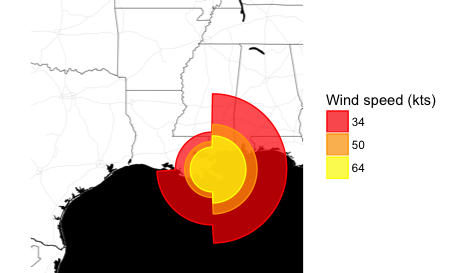

# Building Data Visualization Tools

The data science revolution has produced reams of new data from a wide
variety of new sources. These new datasets are being used to answer new
questions in ways never before conceived. Visualization remains one of the
most powerful ways draw conclusions from data, but the influx of new
data types requires the development of new visualization techniques and
building blocks. This section provides you with the skills for creating those
new visualization building blocks. We focus on the ggplot2 framework and
describe how to use and extend the system to suit the specific needs of your
organization or team.
The objectives for this section are:

* Create data graphics using the ggplot2 package
* Build graphics by combining multiple geoms
* Recognize the differences between different geom_* functions
* Recall the difference between mapping an aesthetic to a constant and
mapping an aesthetic to a variable
* Create a scatterplot or a histogram using ggplot2
* Build plots using the six guidelines for good graphics
* Create simple maps using ggplot2
* Create dynamic maps using the ggmap package
* Build maps that have external data overlaid
* Create chloropleth maps of US counties
* Recognize the different graphical objects presented by the grid package
* Build build simple graphics using the grid package
* Create a ggplot2 theme by modifying an existing theme
* Build a new geom function to implement a new feature or simplify a
workflow

# Peer-graded Assignment: Build a New Geom

>The purpose of this assignment is to draw on your knowledge of the grid and ggplot2 package to build a new geom.
You will then need to load and tidy the provided dataset in order to plot the geom on a map.
Hurricanes can have asymmetrical wind fields, with much higher winds on one side of a storm compared
to the other. Hurricane wind radii report how far winds of a certain intensity (e.g., 34, 50, or 64 knots)
extended from a hurricane’s center, with separate values given for the northeast, northwest, southeast,
and southwest quadrants of the storm. The 34 knot radius in the northeast quadrant, for example,
reports the furthest distance from the center of the storm of any location that experienced 34-knot winds in that quadrant.
This wind radii data provide a clearer picture of the storm structure than the simpler measurements
of a storm’s position and maximum winds. For example, if a storm was moving very quickly,
the forward motion of the storm might have contributed significantly to wind speeds to
the right of the storm’s direction of forward motion, and wind radii might be much larger for the
northeast quadrant of the storm than the northwest quadrant. These wind radii are available
for Atlantic basin tropical storms since 1988 through the Extended Best Tract dataset, available [here](http://rammb.cira.colostate.edu/research/tropical_cyclones/tc_extended_best_track_dataset/)

>Here is an example of the wind radii chart for Hurricane Katrina for the storm observation recorded
at 2005-08-29 12:00:00 UTC, right around the time the storm made landfall.

